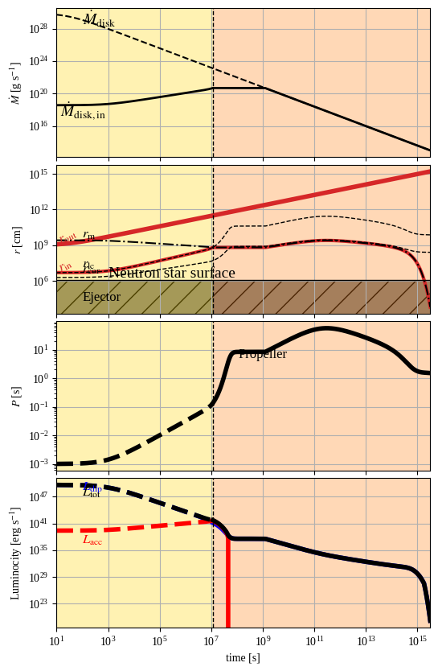

# MagnetarSpinDown
A python model for the newly-born magnetar spin-down
## Sources:  
Model is build using literautre and accompanied codes to:
1. [Ronchi et al. (2022)](https://arxiv.org/abs/2201.11704)
2. [Gibson et al. (2017)](https://academic.oup.com/mnras/article/470/4/4925/3869630)
3. [Gompertz et al. (2014)](https://academic.oup.com/mnras/article/438/1/240/1031361)

Example output:
1. File: `magnetar_evol.h5` that contains the result of the evolution and can be used in `PyBlastAfterglowMag` code
2. Figure:
